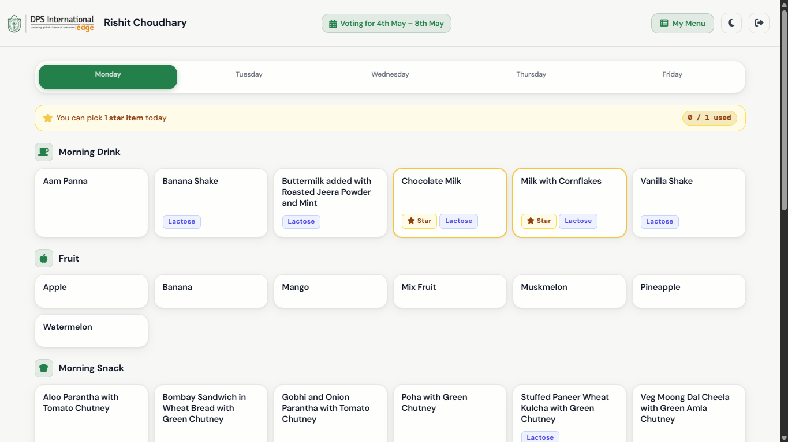

# School Menu Voting System

A menu voting system for my school.

## Live Demo

[Visit Website](https://dpsimenu.in) — Only accessible through valid school email IDs

## Overview

This project aims to give students a choice in the order of items in the school menu. It was created after observing students' frustration with the combinations of food on certain days, and this system allows them to vote for their preferences and reduces frustration.

## Features

- Admin CMS for item input
- Proper vote collection via database
- Majority-based final outcome + edge-case handling

## Technologies

- HTML
- CSS
- JavaScript
- Supabase

## Screenshots

## Future Improvements

- Automate data inputs from pre-created menu plans
- Provide detailed reports based on voting statistics

## Status

Complete
Ready for deployment
